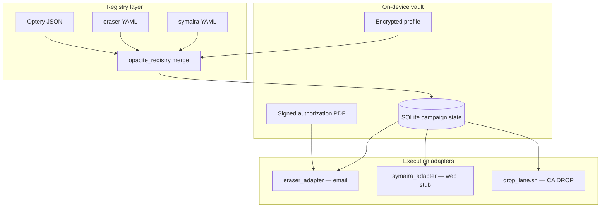

# Architecture

opacite is a thin local orchestrator. It does not replace [eraser](https://github.com/digisamroc/eraser), [symaira](https://github.com/danieljustus/symaira-eraseme), or [vanish](https://github.com/RAMBOXIE/vanish). It owns encrypted profile storage, registry merge, campaign state, and human approval gates.

**Not legal advice.**

## Design bet

Compose existing FOSS removal runners behind one machine-local layer: encrypted profile, unified broker registry, SQLite campaign events, exposure scoring, operator `--confirm`. Target functional overlap with paid broker-removal services on **registry coverage**, not their human support tier. Coverage claims wait for Phase 6 measurement (see [ROADMAP](references/ROADMAP.md)).

## Data flow

```
registry_sync.sh     → unified-brokers.json (localonly/, gitignored)
registry_health.sh   → registry_health.json (reachable | blocked | dead)
optout_runner --plan → campaign_plan.json + PLANNED events
optout_runner --confirm --lane email → eraser_adapter.py → SUBMITTED | FAILED + evidence log
manual_tasks_export  → exports/manual_tasks.{json,md}
```

## Component graph



## Campaign state machine

```
PLANNED → APPROVED → SUBMITTED → AWAITING_REPLY → VERIFIED_REMOVED | RE_LISTED | MANUAL_REQUIRED | FAILED
```

| State | Meaning |
|-------|---------|
| PLANNED | Batch drafted; no network I/O |
| APPROVED | Dry-run eraser completed (`OPACITE_ERASER_DRY_RUN=1`) |
| SUBMITTED | Live request sent via eraser or adapter |
| AWAITING_REPLY | Broker email needs operator action |
| MANUAL_REQUIRED | CAPTCHA, ID upload, broken form |
| FAILED | Hard error; see evidence log |

Schema: [`schemas/campaign.sql`](schemas/campaign.sql). Helpers: [`scripts/opacite_lib.py`](scripts/opacite_lib.py).

## Lane selection

| Process | Runner | Phase |
|---------|--------|-------|
| `email-opt-out` | eraser via `eraser_adapter.py` | **2 (done)** |
| `direct-form` / people-search | symaira (stub), vanish, AIR | 3 |
| `drop-centralized` | `drop_lane.sh` + operator portal | 4 |
| `id-verification` | manual queue only | never auto |

Full taxonomy: [`references/broker-taxonomy.md`](references/broker-taxonomy.md).

## Eraser ID resolution

Unified registry uses Optery numeric ids (`21022`). Eraser YAML uses slugs (`33-mile-radius`). `eraser_adapter.py` resolves by `eraser_id`, email, name slug, or synthesizes a minimal YAML row from `contact_email`. Registry merge attaches `eraser_id` when eraser rows match Optery brokers by name or email.

## Security model

| Topic | Approach |
|-------|----------|
| Vault | `age` or openssl via `vault_init.sh` |
| SMTP | macOS Keychain (`keychain_smtp.sh`) or `~/.eraser/config.yaml` |
| Sends | `--confirm` required; mandate manifest before email lane |
| Logs | Evidence under `localonly/cases/<slug>/evidence/` (gitignored) |

Details: [`SECURITY.md`](SECURITY.md).

## Anti-patterns

1. Cloud profile sync (violates local-first).
2. Auto-submit all brokers without review (wrong-person risk).
3. Greenfield 1,200-broker registry (compose Optery + symaira + eraser instead).
4. CapSolver on every broker by default (cost, ToS, telemetry).

## Milestones

| Milestone | Status |
|-----------|--------|
| M1 Registry + plan | Done |
| M2 Email lane + mandate + manual export | Done |
| M3 Web lane + manual queue UI | In progress |
| M4 CA DROP integration | Doc + recorder shipped |
| M5–M6 Rescan + coverage metrics | Planned |

Roadmap detail: [`references/ROADMAP.md`](references/ROADMAP.md).
