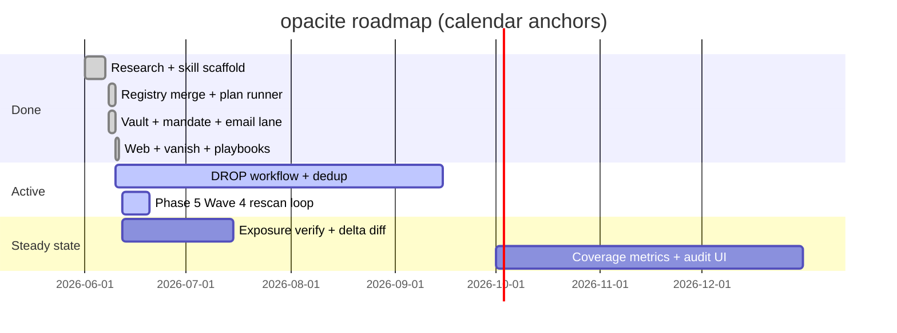

# opacite roadmap

**Status:** 2026-06-12 · **Shipped:** `v0.5.3` (`0f8cbe3`) · **Evidence base (archived):** `localonly/archive/research/palamedes-synthesis-reviewed.md`  
**Not legal advice.** **Not a removal guarantee.**

---

## Gap inventory (adversarial audit — 2026-06-12)

Brutal truth table after Wave 3 landed and Wave 4 preflight (`localonly/trainer-reviews/code-review-wave4-preflight-2026-06-12.md`). Rows marked **doc lie** were previously overstated in this file or user-facing copy.

| Gap | Severity | Honest status | Wave / owner |
|-----|----------|---------------|--------------|
| Rescan scheduler (60d / 90d) | P1 | **Shipped** — `rescan_scheduler.sh` dry-run planner + launchd/cron docs (PR pending) | Wave 4 · `rescan-scheduler` ✅ |
| Verify wired to exposure/rescan | P1 | **Shipped** — `exposure_scan.sh --verify`; `OPACITE_EXPOSURE_VERIFY=1` on scan confirm (PR pending) | Wave 4 · `exposure-verify-wire` ✅ |
| Verify dry-run without vanish CLI | P1 | **Fixed** — verify dry-run CI-safe like scan | Wave 4 · `exposure-verify-wire` ✅ |
| `--delta-only` report diff | P2 | **Seed only** — filters `RE_LISTED`; no diff vs prior `exposure_report.json` | Wave 4 · `exposure-delta-diff` |
| `RE_LISTED` / `VERIFIED_REMOVED` writers | P2 | **Schema only** — no production `append_event` for exposure terminal states (**doc lie** on 5.2 ✅) | Wave 4 · verify + delta agents |
| `exposure_status` ≠ `request_status` | P2 | **Principle #5 doc-only** — verify writes `APPROVED`/`SUBMITTED`, not exposure KPIs | Wave 4 · `exposure-verify-wire` |
| Quarterly operator ritual | P3 | **Missing** from `SKILL.md` | Wave 4 · `roadmap-ritual-sync` |
| `status_summary()` lane partition | P2 | **Deferred** — global per-broker counts blur multi-lane cases | Post–Wave 4 |
| `drop_dedup` auto-hook in email `--plan` | P4 | **Manual** — operator runs `drop_dedup.py` | Out of scope |
| Phase 3.5 IMAP triage | — | **Not started** | Phase 3.5 |
| Phase 6 automation ceiling | — | **Not started** — open bet still **speculative** | Phase 6 |
| Incogni parity claim | — | **Not met** — no unattended rescan loop, no exposure_status KPI, no dashboard | Phase 5–6 |

**What v0.5.3 actually ships:** dry-run exposure scan via `--lane scan --confirm`; `exposure_plan.json` + `exposure_report.json`; lane=`scan` SQLite `PLANNED`/`APPROVED`/`MANUAL_REQUIRED`; live vanish **scan** delegation when `OPACITE_EXPOSURE_EXECUTE=1`. That is **discovery planning**, not steady-state rescan.

**Kill / downgrade triggers (unchanged):**

- Phase 6.2 shows >35% top-50 people-search Tier C with no email fallback → scope to email + DROP + guided forms.
- Any default CapSolver / cloud LLM triage → **reject** (iron law).

---

## North star

Local-first orchestration that composes FOSS broker-removal tools behind an encrypted vault, human approval gates, and a unified campaign state machine — so a technical operator can pursue **informational opacity** (Glissant: refusal of total legibility to broker systems) without handing a full PII package to a subscription vendor.

**Verified anchors** (do not market beyond these):

| Fact | Source |
|------|--------|
| Paid services send real requests; outcomes are uneven and incomplete | PI Solutions Q12–Q13 |
| Incogni markets 420+ brokers; 60d / 90d rescan cadence | incogni.com Q1–Q2 |
| FOSS registries: eraser 764 email brokers; symaira 1,279 YAML files | GitHub Q5–Q7 |
| CA DROP live Jan 2026; broker enforcement Aug 2026; 545 registered brokers Jan 2026 | DataGrail Q8–Q11 |

**Open bet [speculative]:** “Most Incogni-class *broker-count* coverage is automatable for a technical operator.” **Kill:** Opus/Piranesi automation-ceiling table shows >35% of top-50 people-search sites are Tier C with no email fallback → downgrade scope to “email + DROP + guided forms only.”

---

## Principles (non-negotiable)

1. PII encrypted on device; no cloud telemetry.
2. No outbound request without operator `--confirm` (batch or per-broker).
3. Compose FOSS — do not greenfield a 1,200-broker registry.
4. Manual queue for ID verification; never auto-upload government ID.
5. Track `request_status` and `exposure_status` separately (brokers often confirm “no file” while listings persist).

---

## Phase map

---

## Phase 0 — Research & scaffold ✅

**Goal:** Know the landscape; ship skill + script stubs.

| Deliverable | Status |
|-------------|--------|
| Palamedes synthesis + adversarial review | ✅ `localonly/archive/research/palamedes-synthesis-reviewed.md` |
| FOSS repo inventory (GitHub/Codeberg) | ✅ `localonly/archive/research/lane-foss-repos-github-codeberg.md` |
| Gap analysis (manual 20%) | ✅ `localonly/archive/research/lane-gap-analysis.md` |
| Architecture + taxonomy + legal constraints | ✅ `references/` |
| Script stubs: bootstrap, registry_sync, exposure_scan, optout_runner | ✅ `scripts/` |
| Piranesi packet for external deep research | ✅ `references/piranesi-external-research-packet.md` |

**Exit:** Operator can dry-run registry sync and campaign **plan** with no network sends.

---

## Phase 1 — Registry SSOT & campaign planner (M1) ✅

**Goal:** One merged broker graph; deterministic campaign plans per lane.

| # | Work item | Acceptance | Status |
|---|-----------|------------|--------|
| 1.1 | Unified registry merge (Optery + eraser email graph) | `unified-brokers.json` with stable `broker_id`, `process`, `jurisdiction` | ✅ Optery+eraser (1720 brokers verified 2026-06-08) |
| 1.1b | symaira YAML merge | Dedup by id/email | ✅ tarball extract + `opacite_registry.py` |
| 1.2 | Link-check pass on opt-out URLs | `registry_health.json` with unreachable % | ✅ `registry_health.sh` |
| 1.3 | `optout_runner.sh --plan` emits campaign JSON | Plan for N brokers; no SMTP | ✅ |
| 1.4 | SQLite campaign schema | Events: PLANNED → … → FAILED | ✅ `schemas/campaign.sql` + `opacite_lib.py` |
| 1.5 | Alias expansion in profile (≥3 emails, addresses, phones) | Reduces homonym miss rate | ✅ `expand_profile_aliases()` |

**Dependencies:** `schemas/broker.schema.json`, `registry_sync.sh`.

**Exit:** `optout_runner.sh --case me --plan --lane email --max 50` produces reviewable batch + `state.sqlite` PLANNED events. **Met** for small batches.

---

## Phase 2 — Vault, mandate & email lane (M2) ✅

**Goal:** First real outbound lane with legal framing and encrypted profile.

| # | Work item | Acceptance | Status |
|---|-----------|------------|--------|
| 2.1 | Encrypted profile vault (`age` or openssl) | `vault_init.sh --encrypt` | ✅ |
| 2.2 | Authorized-agent mandate (MD + HTML) | `mandate_generate.py --case` | ✅ print-to-PDF |
| 2.3 | eraser adapter: `--lane email --confirm` | SUBMITTED events in SQLite | ✅ `eraser_adapter.py` |
| 2.4 | Dry-run default; `--confirm` required | Enforced | ✅ |
| 2.5 | SMTP secrets in macOS Keychain only | No passwords in yaml | ✅ `keychain_smtp.sh` |
| 2.6 | Mandate gate before email `--confirm` | `require_mandate()` unless `OPACITE_SKIP_MANDATE=1` | ✅ |
| 2.7 | Manual task export after sends | `manual_tasks_export.py` → `exports/manual_tasks.{json,md}` | ✅ |

**Verified constraint:** Eraser README — many brokers need confirm links / forms / ID (Q4). Expect **manual follow-up queue**, not full automation.

**Exit:** Operator completes first 20-email batch with audit trail; manual tasks exported for Q4-class replies. **Met** (operator runs live send locally).

---

## Phase 3 — Web & browser-assisted lane (M3) ✅

**Goal:** Cover people-search and form brokers (Tier B); formalize manual queue (Tier C).

| # | Work item | Acceptance | Status |
|---|-----------|------------|--------|
| 3.1 | symaira adapter (`run-web-form` per broker + consent gate) | Web-form brokers run with `OPACITE_SYMAIRA_EXECUTE=1` | ✅ `symaira_adapter.py`; wired in `optout_runner --lane web` |
| 3.2 | vanish integration (scan/verify; opt-out after consent gate) | Evidence path in SQLite; `--lane vanish` in runner | ✅ `vanish_adapter.py` scan/verify; opt-out blocked Phase 3 |
| 3.3 | Operator playbooks (people-search / form brokers) | ≥20 sites with documented process | ✅ 25 playbooks + `playbook-index.md` |
| 3.4 | `manual_tasks` queue (MD + JSON): IDV, CAPTCHA, broken URL | Never stores ID images in repo | ✅ `manual_tasks_export.py` (post-confirm hint on web/vanish/email) |
| 3.5 | Inbox triage v1: IMAP classify `confirm_link` / `removed_ack` / `need_more_info` | Operator reviews; optional offline LLM only | ⏳ Phase 3.5 |

**Kill gate:** Do not enable CapSolver by default (cost, ToS, telemetry). Manual-first.

**Exit:** One end-to-end campaign across email + 10 web brokers with manual queue populated for failures. **Met** for lane wiring (v0.5.2); live symaira/vanish execute remains operator opt-in via env vars.

---

## Phase 4 — California DROP integration — **active**

**Goal:** Single-shot deletion for all registered CA data brokers when enforcement is live.

| # | Work item | Acceptance | Status |
|---|-----------|------------|--------|
| 4.1 | DROP consumer flow doc + checklist (primary: privacy.ca.gov when accessible) | Operator steps for resident + authorized agent | ✅ `drop-workflow.md`, `drop_lane.sh` |
| 4.2 | Dedup strategy: DROP brokers ⊖ email campaign overlap | No duplicate requests same week without operator opt-in | ✅ `drop_dedup.py` (operator-run before email batch) |
| 4.3 | Calendar reminder: **Aug 1, 2026** enforcement window | Campaign template ready before date | ⏳ operator calendar |
| 4.4 | Track DROP submission separately in SQLite | `lane=drop` events distinct from eraser | ✅ `lane=drop` aggregate event |

**Verified:** 545 registered brokers (Jan 2026); one request applies to all registered (Q10–Q11). Non-registered brokers still need Phase 2–3 (Q13).

**Exit:** CA resident operator submits DROP once; registry marks 545 brokers as SUBMITTED via DROP lane.

---

## Phase 5 — Discovery, verify & rescan (steady state) — **active (Wave 4)**

**Goal:** Match Incogni loop: scan → request → verify → rescan. **Honest progress:** ~40% — discovery dry-run ships; verify, delta diff, scheduler, and exposure KPIs do not.

| # | Work item | Acceptance | Status |
|---|-----------|------------|--------|
| 5.1 | `exposure_scan.sh` live mode + `optout_runner --lane scan --confirm` | `exposure_plan.json` + `exposure_report.json`; lane=`scan` SQLite PLANNED/APPROVED; vanish delegation when `OPACITE_EXPOSURE_EXECUTE=1` | ✅ Wave 3 (`v0.5.3`); match detail from vanish JSON when installed |
| 5.2 | Delta scan: re-queue only changed / relisted brokers | `--delta-only` skips unchanged vs last `exposure_report.json`; re-queue `RE_LISTED` + new/changed matches | 🟡 **partial** — RE_LISTED filter seed only; **no report diff**; **no production writer** for `RE_LISTED`/`VERIFIED_REMOVED` |
| 5.3 | Scheduler: **60d** people-search / **90d** private DB cadence (Incogni Q2) | `rescan_scheduler.sh --dry-run` prints next due; launchd/cron templates in `references/rescan-scheduler.md` | ✅ Wave 4 agent 1 (`rescan_scheduler.py`); operator still runs suggested commands manually |
| 5.4 | vanish-style verify pass for sample brokers | `--verify` or scan-lane verify path; `exposure_status` (`VERIFIED_REMOVED`/`RE_LISTED`) independent of `request_status` (`SUBMITTED` on email/web) | ✅ Wave 4 agent 2 — dry-run + live path on lane=`scan`; vanish lane verify unchanged |
| 5.5 | Quarterly operator review ritual (15 min) | Documented in `SKILL.md` + ROADMAP cross-link | ⏳ **Wave 4 agent 4** |

**Verified (2026-06-12):** Scan dry-run needs no vanish CLI (CI-safe). Verify dry-run **does not** — asymmetry is a known P1 gap. Live execute without vanish records `MANUAL_REQUIRED` on lane=`scan`, not a hard crash.

**Phase 5 exit criteria (falsifiable):**

1. `bash scripts/rescan_scheduler.sh --case <slug> --dry-run` → exit 0, prints 60d/90d due dates, no network.
2. `bash scripts/exposure_scan.sh --case <slug> --verify --dry-run` → exit 0 without vanish installed; updates `exposure_report.json`.
3. Second scan with `--delta-only` skips unchanged brokers (fixture or temp case).
4. Operator can run quarterly ritual from `SKILL.md` without opening ROADMAP.

**Current exit:** **Not met** — operator can `--lane scan --confirm` dry-run only.

---

## Phase 6 — Evidence, metrics & external research ingest

**Goal:** Replace speculative coverage claims with measured ceilings.

| # | Work item | Acceptance |
|---|-----------|------------|
| 6.1 | Run Piranesi → Opus packet; Palamedes Pattern 8 ingest | `external-opus-return.md` verified |
| 6.2 | Automation ceiling table: top 50 US people-search sites | Tier A/B/C per site with source URL |
| 6.3 | Local HTML/SQLite dashboard: requests sent, exposure delta, manual queue depth | No external analytics |
| 6.4 | Authorized-agent field matrix (jurisdiction × fields) | `references/legal-constraints.md` updated from ingest |
| 6.5 | Revisit “coverage %” only after 6.2 | Update ROADMAP bet or kill |

**Exit:** Published **measured** automation ceiling; no “80%” in user-facing copy unless empirically supported.

---

## Compose stack (frozen unless evidence changes)

| Role | Upstream | opacite owns |
|------|----------|--------------|
| Registry bulk | symaira, Optery OSS, eraser/datapurge YAML | Merge, health check, lane tags |
| Email sends | eraser | Adapter, state, mandate attach |
| Web/forms | symaira, AIR/Privotron patterns | Playbooks, consent gates |
| Guided hard sites | vanish | Verify/report patterns |
| CA one-shot | DROP portal | Checklist, dedup, tracking |
| Orchestration | — | Vault, planner, SQLite, human queue |

---

## Out of scope (permanent)

- Cloud-hosted PII processing or vendor dashboard
- Automated government ID submission
- “100% removal” or “guaranteed erasure” marketing
- Employment screening / OSINT dossiers (use `engram` read-only separately)
- Greenfield 1,200-broker registry without upstream sync

---

## Success metrics (honest)

| Metric | Target | Notes |
|--------|--------|-------|
| Registry freshness | <10% dead opt-out URLs | After link-check |
| Email lane throughput | Operator-approved batches complete | Not “all removed” |
| Manual queue depth | Trending down on repeat rescans | Re-listing expected (Q13) |
| Exposure delta | Fewer high-confidence matches quarter-over-quarter | Primary outcome |
| Operator time | <2 hr/month after steady state | vs Incogni ~0 hr |
| Privacy | Zero third-party analytics events | Auditable |

Do **not** use “brokers removed” as sole KPI — brokers count requests complete without confirming deletion (Incogni semantics; track both statuses).

---

## Immediate next actions (this week)

**Wave 4 (sequential — manifest `localonly/daily/2026-06-12.md`):**

1. `rescan-scheduler` → `rescan_scheduler.sh` + launchd/cron docs.
2. `exposure-verify-wire` → `--verify` path + CI-safe dry-run.
3. `exposure-delta-diff` → report diff + terminal exposure events.
4. `roadmap-ritual-sync` → SKILL quarterly ritual + ROADMAP truth pass.
5. `skill-version-bump` → `v0.5.4` + deai on user-facing prose.

**Operator (parallel, not blocked on Wave 4):**

1. Exposure scan dry-run — `optout_runner.sh --case <slug> --lane scan --confirm`.
2. If CA resident: DROP before **Aug 1, 2026**; then `drop_dedup.py --case <slug> --dry-run`.
3. Phase 6.1: Piranesi → Opus automation-ceiling ingest when ready.

---

## Document index

| File | Role |
|------|------|
| `references/ROADMAP.md` | This file |
| `references/ARCHITECTURE.md` | Component graph, state machine |
| `references/broker-taxonomy.md` | Process types |
| `references/legal-constraints.md` | DROP/CCPA/GDPR constraints |
| `localonly/archive/research/` | Archived Palamedes + lane research (not operator-facing) |
| `references/comparable-foss-repos.md` | Operator-facing FOSS index |
| `references/rescan-scheduler.md` | 60d/90d cadence + launchd/cron templates |
