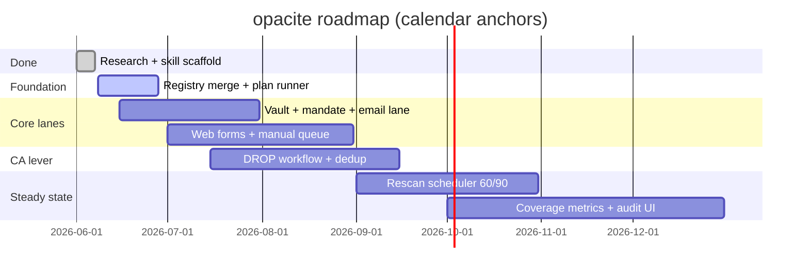

# opacite roadmap

**Status:** 2026-06-07 · **Evidence base (archived):** `localonly/archive/research/palamedes-synthesis-reviewed.md`  
**Not legal advice.** **Not a removal guarantee.**

---

## North star

Local-first orchestration that composes FOSS broker-removal tools behind an encrypted vault, human approval gates, and a unified campaign state machine — so a technical operator can pursue **informational opacity** (Glissant: refusal of total legibility to broker systems) without handing a full PII package to a subscription vendor.

**Verified anchors** (do not market beyond these):

| Fact | Source |
|------|--------|
| Paid services send real requests; outcomes are uneven and incomplete | PI Solutions Q12–Q13 |
| Incogni markets 420+ brokers; 60d / 90d rescan cadence | incogni.com Q1–Q2 |
| FOSS registries: eraser 764 email brokers; symaira 1,279 YAML files | GitHub Q5–Q7 |
| CA DROP live Jan 2026; broker enforcement Aug 2026; 545 registered brokers Jan 2026 | DataGrail Q8–Q11 |

**Open bet [speculative]:** “Most Incogni-class *broker-count* coverage is automatable for a technical operator.” **Kill:** Opus/Piranesi automation-ceiling table shows >35% of top-50 people-search sites are Tier C with no email fallback → downgrade scope to “email + DROP + guided forms only.”

---

## Principles (non-negotiable)

1. PII encrypted on device; no cloud telemetry.
2. No outbound request without operator `--confirm` (batch or per-broker).
3. Compose FOSS — do not greenfield a 1,200-broker registry.
4. Manual queue for ID verification; never auto-upload government ID.
5. Track `request_status` and `exposure_status` separately (brokers often confirm “no file” while listings persist).

---

## Phase map

---

## Phase 0 — Research & scaffold ✅

**Goal:** Know the landscape; ship skill + script stubs.

| Deliverable | Status |
|-------------|--------|
| Palamedes synthesis + adversarial review | ✅ `localonly/archive/research/palamedes-synthesis-reviewed.md` |
| FOSS repo inventory (GitHub/Codeberg) | ✅ `localonly/archive/research/lane-foss-repos-github-codeberg.md` |
| Gap analysis (manual 20%) | ✅ `localonly/archive/research/lane-gap-analysis.md` |
| Architecture + taxonomy + legal constraints | ✅ `references/` |
| Script stubs: bootstrap, registry_sync, exposure_scan, optout_runner | ✅ `scripts/` |
| Piranesi packet for external deep research | ✅ `references/piranesi-external-research-packet.md` |

**Exit:** Operator can dry-run registry sync and campaign **plan** with no network sends.

---

## Phase 1 — Registry SSOT & campaign planner (M1) ✅

**Goal:** One merged broker graph; deterministic campaign plans per lane.

| # | Work item | Acceptance | Status |
|---|-----------|------------|--------|
| 1.1 | Unified registry merge (Optery + eraser email graph) | `unified-brokers.json` with stable `broker_id`, `process`, `jurisdiction` | ✅ Optery+eraser (1720 brokers verified 2026-06-08) |
| 1.1b | symaira YAML merge | Dedup by id/email | ✅ tarball extract + `opacite_registry.py` |
| 1.2 | Link-check pass on opt-out URLs | `registry_health.json` with unreachable % | ✅ `registry_health.sh` |
| 1.3 | `optout_runner.sh --plan` emits campaign JSON | Plan for N brokers; no SMTP | ✅ |
| 1.4 | SQLite campaign schema | Events: PLANNED → … → FAILED | ✅ `schemas/campaign.sql` + `opacite_lib.py` |
| 1.5 | Alias expansion in profile (≥3 emails, addresses, phones) | Reduces homonym miss rate | ✅ `expand_profile_aliases()` |

**Dependencies:** `schemas/broker.schema.json`, `registry_sync.sh`.

**Exit:** `optout_runner.sh --case me --plan --lane email --max 50` produces reviewable batch + `state.sqlite` PLANNED events. **Met** for small batches.

---

## Phase 2 — Vault, mandate & email lane (M2) ✅

**Goal:** First real outbound lane with legal framing and encrypted profile.

| # | Work item | Acceptance | Status |
|---|-----------|------------|--------|
| 2.1 | Encrypted profile vault (`age` or openssl) | `vault_init.sh --encrypt` | ✅ |
| 2.2 | Authorized-agent mandate (MD + HTML) | `mandate_generate.py --case` | ✅ print-to-PDF |
| 2.3 | eraser adapter: `--lane email --confirm` | SUBMITTED events in SQLite | ✅ `eraser_adapter.py` |
| 2.4 | Dry-run default; `--confirm` required | Enforced | ✅ |
| 2.5 | SMTP secrets in macOS Keychain only | No passwords in yaml | ✅ `keychain_smtp.sh` |
| 2.6 | Mandate gate before email `--confirm` | `require_mandate()` unless `OPACITE_SKIP_MANDATE=1` | ✅ |
| 2.7 | Manual task export after sends | `manual_tasks_export.py` → `exports/manual_tasks.{json,md}` | ✅ |

**Verified constraint:** Eraser README — many brokers need confirm links / forms / ID (Q4). Expect **manual follow-up queue**, not full automation.

**Exit:** Operator completes first 20-email batch with audit trail; manual tasks exported for Q4-class replies. **Met** (operator runs live send locally).

---

## Phase 3 — Web & browser-assisted lane (M3)

**Goal:** Cover people-search and form brokers (Tier B); formalize manual queue (Tier C).

| # | Work item | Acceptance |
|---|-----------|------------|
| 3.1 | symaira adapter wrapper (`plan execute` with consent gate) | Web-form brokers run with operator `grant` |
| 3.2 | vanish integration for guided opt-out URLs (top 58) | Opens browser + evidence path in SQLite |
| 3.3 | Port/reference AIR + Privotron + data-broker-optout playbooks as opacite playbooks | ≥20 people-search sites with documented process |
| 3.4 | `manual_tasks` queue (MD + JSON): IDV, CAPTCHA, broken URL | Never stores ID images in repo |
| 3.5 | Inbox triage v1: IMAP classify `confirm_link` / `removed_ack` / `need_more_info` | Operator reviews; optional offline LLM only |

**Kill gate:** Do not enable CapSolver by default (cost, ToS, telemetry). Manual-first.

**Exit:** One end-to-end campaign across email + 10 web brokers with manual queue populated for failures.

---

## Phase 4 — California DROP integration

**Goal:** Single-shot deletion for all registered CA data brokers when enforcement is live.

| # | Work item | Acceptance |
|---|-----------|------------|
| 4.1 | DROP consumer flow doc + checklist (primary: privacy.ca.gov when accessible) | Operator steps for resident + authorized agent |
| 4.2 | Dedup strategy: DROP brokers ⊖ email campaign overlap | No duplicate requests same week without operator opt-in |
| 4.3 | Calendar reminder: **Aug 1, 2026** enforcement window | Campaign template ready before date |
| 4.4 | Track DROP submission separately in SQLite | `lane=drop` events distinct from eraser |

**Verified:** 545 registered brokers (Jan 2026); one request applies to all registered (Q10–Q11). Non-registered brokers still need Phase 2–3 (Q13).

**Exit:** CA resident operator submits DROP once; registry marks 545 brokers as SUBMITTED via DROP lane.

---

## Phase 5 — Discovery, verify & rescan (steady state)

**Goal:** Match Incogni loop: scan → request → verify → rescan.

| # | Work item | Acceptance |
|---|-----------|------------|
| 5.1 | `exposure_scan.sh` live mode (rate-limited people-search queries) | `exposure_report.json` + match scores |
| 5.2 | Delta scan: only re-queue RE_LISTED brokers | Diff against last scan |
| 5.3 | Scheduler: **60d** people-search / **90d** private DB cadence (Incogni Q2) | launchd/cron template in repo |
| 5.4 | vanish-style verify pass for sample brokers | `exposure_status` updated independently of `request_status` |
| 5.5 | Quarterly operator review ritual (15 min) | Documented in SKILL.md |

**Exit:** Second quarterly rescan runs unattended except operator approval for new submissions.

---

## Phase 6 — Evidence, metrics & external research ingest

**Goal:** Replace speculative coverage claims with measured ceilings.

| # | Work item | Acceptance |
|---|-----------|------------|
| 6.1 | Run Piranesi → Opus packet; Palamedes Pattern 8 ingest | `external-opus-return.md` verified |
| 6.2 | Automation ceiling table: top 50 US people-search sites | Tier A/B/C per site with source URL |
| 6.3 | Local HTML/SQLite dashboard: requests sent, exposure delta, manual queue depth | No external analytics |
| 6.4 | Authorized-agent field matrix (jurisdiction × fields) | `references/legal-constraints.md` updated from ingest |
| 6.5 | Revisit “coverage %” only after 6.2 | Update ROADMAP bet or kill |

**Exit:** Published **measured** automation ceiling; no “80%” in user-facing copy unless empirically supported.

---

## Compose stack (frozen unless evidence changes)

| Role | Upstream | opacite owns |
|------|----------|--------------|
| Registry bulk | symaira, Optery OSS, eraser/datapurge YAML | Merge, health check, lane tags |
| Email sends | eraser | Adapter, state, mandate attach |
| Web/forms | symaira, AIR/Privotron patterns | Playbooks, consent gates |
| Guided hard sites | vanish | Verify/report patterns |
| CA one-shot | DROP portal | Checklist, dedup, tracking |
| Orchestration | — | Vault, planner, SQLite, human queue |

---

## Out of scope (permanent)

- Cloud-hosted PII processing or vendor dashboard
- Automated government ID submission
- “100% removal” or “guaranteed erasure” marketing
- Employment screening / OSINT dossiers (use `engram` read-only separately)
- Greenfield 1,200-broker registry without upstream sync

---

## Success metrics (honest)

| Metric | Target | Notes |
|--------|--------|-------|
| Registry freshness | <10% dead opt-out URLs | After link-check |
| Email lane throughput | Operator-approved batches complete | Not “all removed” |
| Manual queue depth | Trending down on repeat rescans | Re-listing expected (Q13) |
| Exposure delta | Fewer high-confidence matches quarter-over-quarter | Primary outcome |
| Operator time | <2 hr/month after steady state | vs Incogni ~0 hr |
| Privacy | Zero third-party analytics events | Auditable |

Do **not** use “brokers removed” as sole KPI — brokers count requests complete without confirming deletion (Incogni semantics; track both statuses).

---

## Immediate next actions (this week)

1. **Phase 3 Wave 2** — `optout-lane-wire`, `roadmap-sync`, `skill-version-bump` (see `localonly/daily/2026-06-10.md`).
2. Operator: Keychain SMTP or `eraser init` → first live `--confirm --max 5` email batch.
3. If CA resident: pre-build DROP submission before **Aug 1, 2026** enforcement; run `drop_dedup.py` after submit.
4. Paste Piranesi packet into Opus when ready for Phase 6.1 automation-ceiling ingest.

---

## Document index

| File | Role |
|------|------|
| `references/ROADMAP.md` | This file |
| `references/ARCHITECTURE.md` | Component graph, state machine |
| `references/broker-taxonomy.md` | Process types |
| `references/legal-constraints.md` | DROP/CCPA/GDPR constraints |
| `localonly/archive/research/` | Archived Palamedes + lane research (not operator-facing) |
| `references/comparable-foss-repos.md` | Operator-facing FOSS index |
